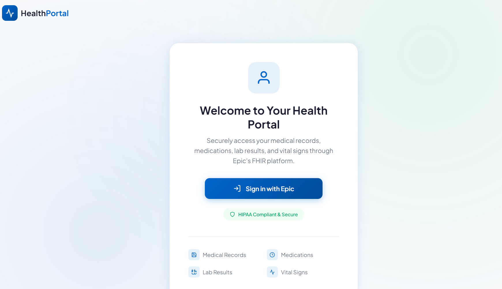
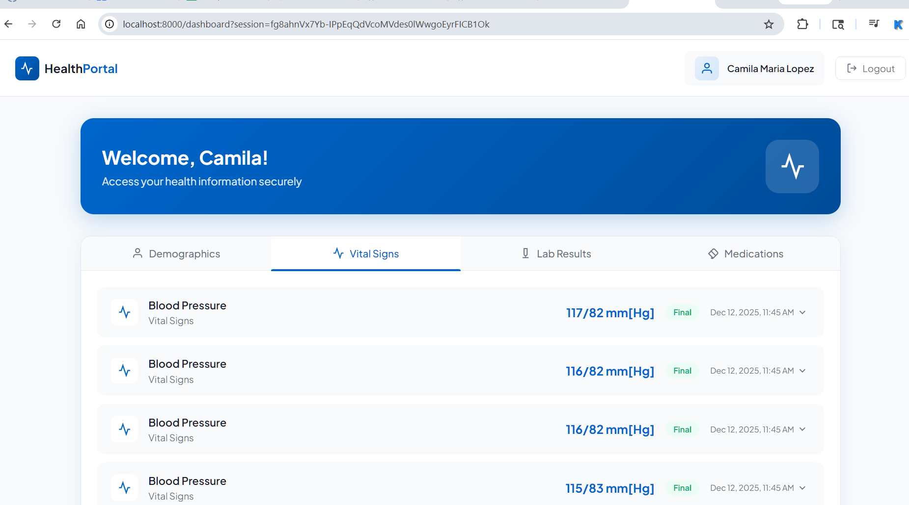

# Epic FHIR Patient Portal

A simple, clean FastAPI application that connects to the **Epic Sandbox FHIR Server** to display patient health information including demographics, medications, lab results, and vital signs.




## Features

✅ **OAuth2 Authentication** - Secure sign-in with Epic accounts  
✅ **Patient Demographics** - View name, gender, DOB, contact info  
✅ **Medications List** - All prescriptions with dosage and status  
✅ **Lab Results** - Laboratory observations with reference ranges  
✅ **Vital Signs** - Blood pressure, heart rate, temperature, etc.  
✅ **Clean, Modern UI** - Responsive design with tabbed navigation  

## Prerequisites

- Python 3.9+
- Epic Sandbox Account (free at [fhir.epic.com](https://fhir.epic.com))

## Quick Start

### 1. Clone & Setup

```bash
# Create virtual environment
python -m venv venv
source venv/bin/activate  # On Windows: venv\Scripts\activate

# Install dependencies
pip install -r requirements.txt
```

### 2. Run the Application

```bash
uvicorn main:app --reload --host 0.0.0.0 --port 8000
```

### 3. Access the Portal

Open your browser to: **http://localhost:8000**

## Using Epic Sandbox

### Test Patient Credentials

When you click "Sign in with Epic", you'll be redirected to Epic's login page. Use these **sandbox test credentials**:

| Username | Password |
|----------|----------|
| `fhirjason` | `epicepic1` |
| `fhircamila` | `epicepic1` |
| `fhirderrick` | `epicepic1` |

> These are pre-configured test patients in Epic's sandbox environment.

### First-Time Login Flow

1. Click **"Sign in with Epic"** on the home page
2. You'll be redirected to Epic's authorization page
3. Enter test credentials (e.g., `fhirjason` / `epicepic1`)
4. Authorize the application to access your data
5. You'll be redirected back to the dashboard with your patient data

## Project Structure

```
epic-fhir-app/
├── main.py              # FastAPI backend with FHIR API calls
├── requirements.txt     # Python dependencies
├── templates/
│   ├── index.html      # Sign-in page
│   └── dashboard.html  # Patient dashboard with tabs
└── README.md
```

## API Endpoints

| Endpoint | Method | Description |
|----------|--------|-------------|
| `/` | GET | Sign-in page |
| `/login` | GET | Initiates Epic OAuth2 flow |
| `/callback` | GET | OAuth2 callback handler |
| `/dashboard` | GET | Patient dashboard |
| `/api/patient/{session_id}` | GET | Patient demographics |
| `/api/medications/{session_id}` | GET | Patient medications |
| `/api/labs/{session_id}` | GET | Lab results |
| `/api/vitals/{session_id}` | GET | Vital signs |
| `/api/logout/{session_id}` | GET | Logout and clear session |

## Configuration

The application uses Epic's **public sandbox** client ID by default. For production use, register your own application at [fhir.epic.com](https://fhir.epic.com).

```python
# main.py - Configuration section
EPIC_CONFIG = {
    "auth_url": "https://fhir.epic.com/interconnect-fhir-oauth/oauth2/authorize",
    "token_url": "https://fhir.epic.com/interconnect-fhir-oauth/oauth2/token",
    "fhir_base_url": "https://fhir.epic.com/interconnect-fhir-oauth/api/FHIR/R4",
    "client_id": "YOUR_CLIENT_ID",  # Replace for production
    "redirect_uri": "http://localhost:8000/callback",
    "scope": "openid fhirUser patient/*.read launch/patient"
}
```

## FHIR Resources Used

- **Patient** - Demographics, identifiers, contact info
- **MedicationRequest** - Prescription medications
- **Observation (category: laboratory)** - Lab test results
- **Observation (category: vital-signs)** - Vital sign measurements

## Security Notes

⚠️ **Development Only** - This example uses in-memory session storage. For production:
- Use a proper session store (Redis, database)
- Implement proper token refresh
- Add HTTPS
- Store secrets in environment variables

## Troubleshooting

### "Access Denied" Error
- Make sure you're using the correct test patient credentials
- The sandbox may be down - check [Epic's status page](https://fhir.epic.com)

### Empty Data in Dashboard
- Not all test patients have medications/labs/vitals
- Try a different test patient (fhircamila has more varied data)

### OAuth Redirect Issues
- Ensure you're running on `localhost:8000`
- Check that the redirect URI matches exactly

## License

MIT License - Feel free to use and modify for your projects.

## Resources

- [Epic FHIR Documentation](https://fhir.epic.com/Documentation)
- [SMART on FHIR](https://docs.smarthealthit.org/)
- [HL7 FHIR Specification](https://hl7.org/fhir/)
- [FastAPI Documentation](https://fastapi.tiangolo.com/)
